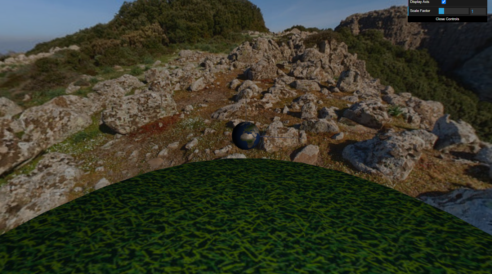
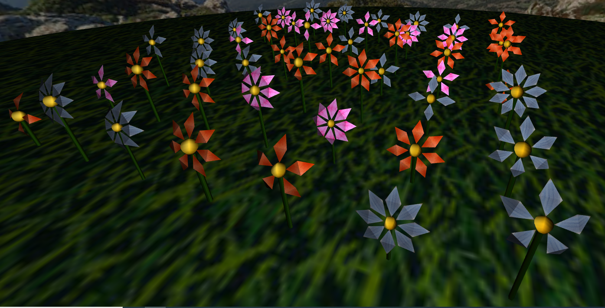

# CG 2023/2024

## Group T07G08

## Project Notes

### 1 - Sky Sphere

#### 1.1 - Criação de uma esfera

- Para a criação desta esfera, criamos a classe `MySphere` e foi necessário ter em atenção os vértices que estavam a ser usados, de modo a não os repetir e fazer este algoritmo o mais eficiente possível. Depois, foi apenas necessário definir a textura em `MyScene` e aplicá-la.

#### 1.2 - 1.2 Adição de Panoramas

- O primeiro passo foi alterar a classe `MySphere`, de modo a a textura poder ser visível por dentro ou por fora.

- Depois, criamos a classe `MyPanorama`, que cria uma esfera com uma textura visível por dentro, e no método `display`, usa a posição da câmara como centro.

### 2 - Flores

#### 2.1 - Modelação de uma flor

- Começámos por criar uma flor, utilizando a classe `MySphere` para a criação do recetáculo, o `MyStem` foi criado tendo como base o cilindro da tp3, e `MyPetal` foi criado com base em dois triângulos que formam um losango.

- Cada flor tem um objeto `MyPetal`que é rodado e desenhado várias vezes para simular as pétalas da flor.

#### 2.2 - Parametrização da flor

- Parametrizámos as classes dos componentes da flor para conseguir obter flores com aspetos diferentes.

- `MyFlower` recebe como argumentos o número de pétalas, o raio do recetáculo, o raio e o número de stacks do caule.

- `MyPetal` recebe como argumentos o ângulo de rotação entre as pétalas e a textura que será usada.

- `MyReceptacle` recebe como argumento o seu raio.

- `MyStem` recebe como argumentos o número de slices e stacks.

#### 2.3 - Aleatoriedade e diversidade na flor

- Criámos o `MyGarden` com alguma aleatoriedade seja nas cores das pétalas, a altura da flor, amplitude das pétalas, número de pétalas, raio do recetáculo, etc...

#### 2.4 - Texturas nas flores

- Colocámos 3 texturas diferentes para as pétalas e apenas uma para o receptáculo e para o caule.

