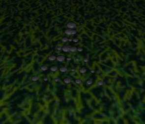
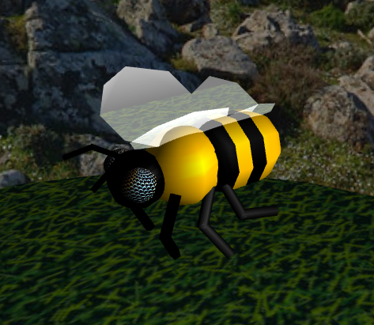
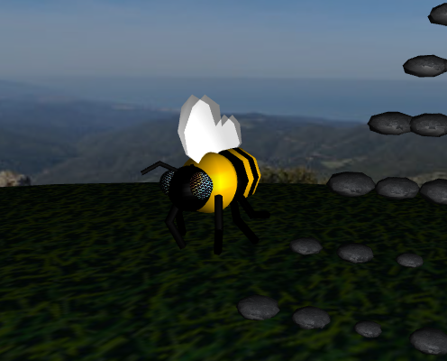
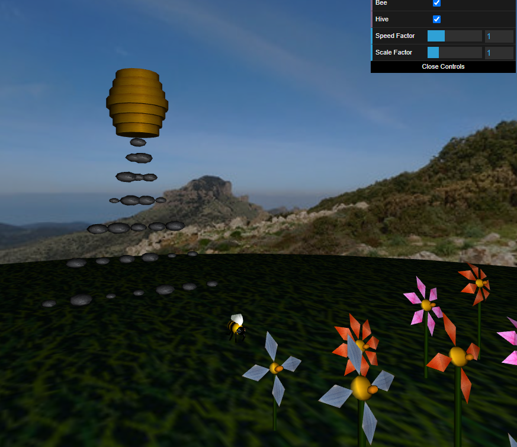

# CG 2023/2024

## Group T07G08

## Project Notes

### 1 - Sky Sphere

#### 1.1 - Criação de uma esfera

- Para a criação desta esfera, criamos a classe `MySphere` e foi necessário ter em atenção os vértices que estavam a ser usados, de modo a não os repetir e fazer este algoritmo o mais eficiente possível. Depois, foi apenas necessário definir a textura em `MyScene` e aplicá-la.

#### 1.2 - 1.2 Adição de Panoramas

- O primeiro passo foi alterar a classe `MySphere`, de modo a a textura poder ser visível por dentro ou por fora.

- Depois, criamos a classe `MyPanorama`, que cria uma esfera com uma textura visível por dentro, e no método `display`, usa a posição da câmara como centro.

### 2 - Flores

#### 2.1 - Modelação de uma flor

- Começámos por criar uma flor, utilizando a classe `MySphere` para a criação do recetáculo, o `MyStem` foi criado tendo como base o cilindro da tp3, e `MyPetal` foi criado com base em dois triângulos que formam um losango.

- Cada flor tem um objeto `MyPetal`que é rodado e desenhado várias vezes para simular as pétalas da flor.

#### 2.2 - Parametrização da flor

- Parametrizámos as classes dos componentes da flor para conseguir obter flores com aspetos diferentes.

- `MyFlower` recebe como argumentos o número de pétalas, o raio do recetáculo, o raio e o número de stacks do caule.

- `MyPetal` recebe como argumentos o ângulo de rotação entre as pétalas e a textura que será usada.

- `MyReceptacle` recebe como argumento o seu raio.

- `MyStem` recebe como argumentos o número de slices e stacks.

#### 2.3 - Aleatoriedade e diversidade na flor

- Criámos o `MyGarden` com alguma aleatoriedade seja nas cores das pétalas, a altura da flor, amplitude das pétalas, número de pétalas, raio do recetáculo, etc...

#### 2.4 - Texturas nas flores

- Colocámos 3 texturas diferentes para as pétalas e apenas uma para o receptáculo e para o caule.

### 3 - Pedras e penedos

- Para criar o `MyRockSet`, criamos um _array_ com elementos `MyRock` com tamanhos aleatórios que será mostrado em forma de pirâmide 2D.

- `MyRock` foi criado com base na classe `MySphere`, em que cada vértice tem um offset aleatório, fazendo uma superfície imperfeita.

### 4 - Abelha

#### 4.1 - Modelação da abelha

- A criação de uma abelha, na classe `MyBee`, envolve várias classes, como `MyBeeHead`(cabeça da abelha), `MyBeeAntenna`(antena da abelha) e `MyBeeLeg`(perna da abelha) e `MyBeeWing`(Asa da abelha).

- `MyBeeHead` utiliza a classe `MySphere` para a cabeça e olhos e a classe `MyBeeAntenna` para as antenas.

- `MyBeeAntenna` e `MyBeeLeg` utilizam a classe `MyStem`(caule da flor), pois é basicamente um cilindro.

- `MyBeeWing` é um objeto formado por triângulos;

- Foi adicionado no fim uma textura transparente às asas;

#### 4.2 - Animação da abelha

- A abelha tem duas animações, uma que envolve uma oscilação para cima e para baixo e outra que é basicamente o batimento de asas.

#### 4.3 - Controlo da abelha

- Adicionámos na classe `MyInterface`, os métodos para processar várias teclas ao mesmo tempo.

- Na classe `MyScene`, acrescentámos o método *`checkKeys()`* ao método *`update()`* .

- Por fim, alterámos a classe `MyBee` de forma a que seja possível rodar, acelerar e travar, tudo para que seja possível andar pela cena.

- Também é possível dar reset para a posição inicial da abelha;

### 5 - Pólen e colmeia

- Criámos as classes `MyPollen` e `MyHive`, usando a classe `MySphere` para o pólen.

- Colocámos a colmeia sobre as pedras/penedos criados no `ponto 3`.

- Também atualizados a classe `MyBee` para conseguir subir e descer.

