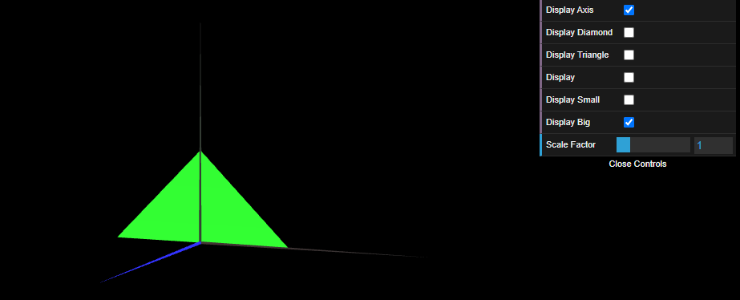

# CG 2023/2024

## Group T07G08

## TP 1 Notes

### `Exercício 1`

- No exercício 1, conseguimos observar as diferentes formas geométricas (losango, paralelogramo e triângulo), e foi possível também criar as checkboxes e manipular as diferentes formas tanto clockwise como counter-clockwise. No paralelogramo foi necessário criar mais vértices do que no losango e no triângulo para assim conseguirmos representá-lo, e tivemos também de definir os indíces em ambos os sentidos para ser visível dos dois lados.

### `Exercício 2`

- No exercício 2, aplicamos as mesmas técnicas que usamos no exercício 1, o que tornou fácil desenhar os triângulos.

