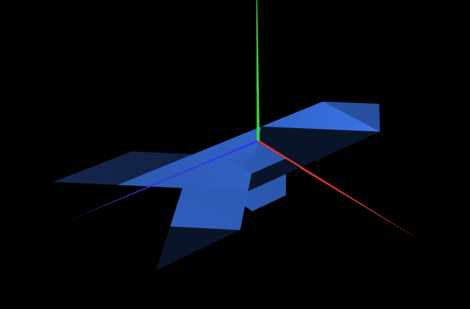
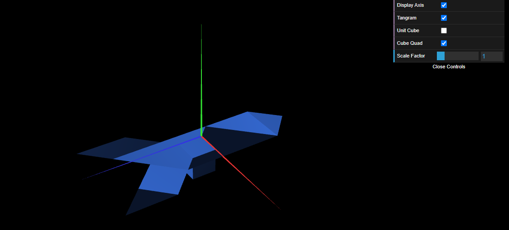

# CG 2023/2024

## Group T07G08

## TP 2 Notes

### 2. Funções WebCGF para transformações geométricas

#### `Exercício 1`

- No exercício 1, apesar de alguma dificuldade a perceber como funciona as matrizes conseguimos, talvez foi mais simples porque apenas tivemos de fazer a translação do diamond.

#### `Exercício 2`

- No exercício 2, foi muito mais fácil colocar as restantes peças na cena com as instruções `CGFscene.translate(x, y, z)` e `CGFscene.rotate(ang, x, y, z)`, pois são instruções mais fáceis de compreender e utilizar.

#### `Exercício 3`

- No exercício 3, conseguimos criar a classe `MyTangram`, como na TP anterior.

### 3. Geometria tridimensional - Cubo Unitário

- Primeiramente, criamos um cubo unitário centrado na origem definindo todos os vértices e desenhando as faces, e foi relativamente simples, sendo que a parte mais difícil foi conseguirmos situar-nos espacialmente para perceber a ordem dos vértices correta para desenhar os triângulos.

- Depois, aplicamos uma translação ao cubo para ele fazer de base para o tangrama, seguida de uma rotação à cena toda para que o tangrama estivesse no plano XZ, seguida de outra translação para alinhar o vértice superior esquerdo do cubo unitário com o origem do plano.

### 4. Geometria composta - Cubo composto por planos

- Neste ponto, criamos um quadrado, tarefa que foi extremamente simples, por já termos feito coisas semelhantes, e depois tivemos de criar um cubo unitário através de transformações a esse quadrado. Este processo não foi difícil, visto que apenas era necessário aplicar uma translação seguida de uma rotação a cada face.

- Achamos este processo mais fácil do que o que fizemos para criar o cubo unitário no ponto `3. Geometria tridimensional`.

- Após `MyUnitCubeQuad` estar criado, centrado na origem do espaço, apenas foi necessário desenhá-lo na classe `MyScene` na linha de código abaixo de onde foi desenhado `MyUnitCube` para lhe aplicar as mesmas transformações.

