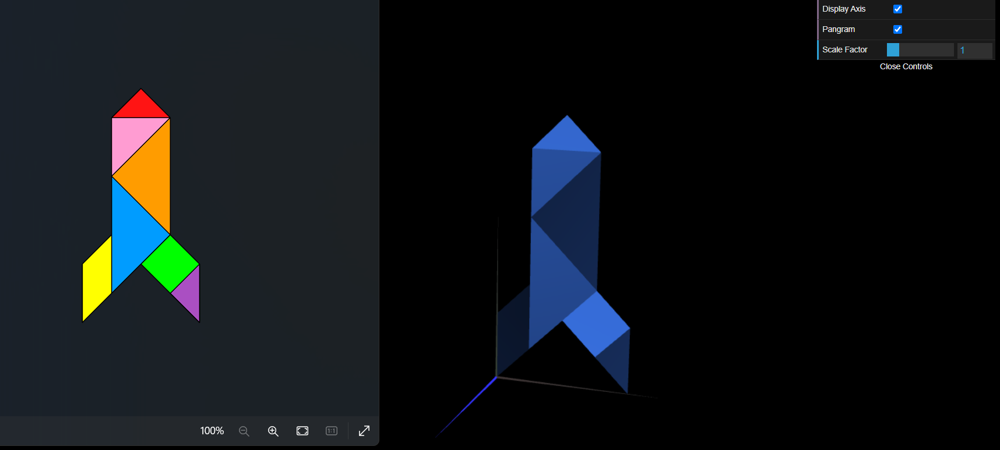

# CG 2023/2024

## Group T07G08

## TP 2 Notes

### 2. Funções WebCGF para transformações geométricas

#### `Exercício 1`

- No exercício 1, apesar de alguma dificuldade a perceber como funciona as matrizes conseguimos, talvez foi mais simples porque apenas tivemos de fazer a translação do diamond.

#### `Exercício 2`

- No exercício 2, foi muito mais fácil colocar as restantes peças na cena com as instruções `CGFscene.translate(x, y, z)` e `CGFscene.rotate(ang, x, y, z)`, pois são instruções mais fáceis de compreender e utilizar.

#### `Exercício 3`

- No exercício 3, conseguimos criar a classe `MyTangram`, como na TP anterior.

