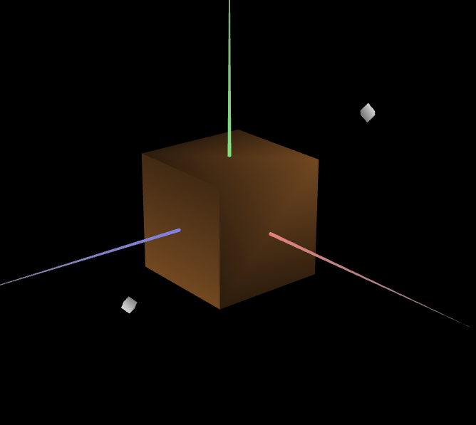
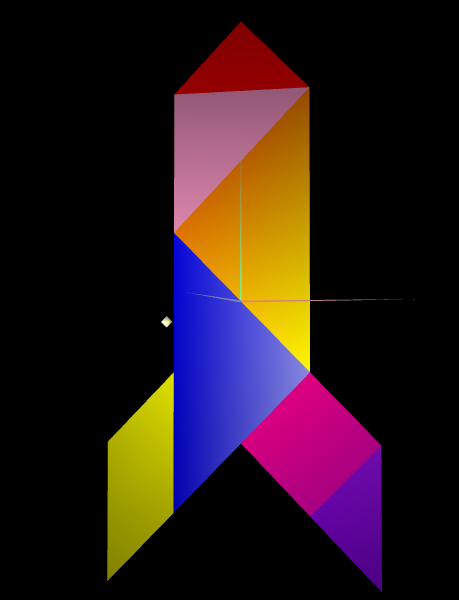

# CG 2023/2024

## Group T07G08

## TP 3 Notes

### Parte 1 - Iluminação e materiais do Tangram

- A primeira parte consistiu em adicionar MyTangram e MyUnitCube à lista de objetos disponíveis e definir as normais para estes objetos. Para isto, foi necessário adicionar mais vértices e desenhar os objetos utilizando estes novos vértices, depois disto, desenhar as normais não foi difícil e conseguimos ver os objetos com definição, distinguindo as diferentes faces do cubo. Foi necessário também definir as funções `enableNormalViz` e `disableNormalViz` na classe MyTangram para poder ver as normais.

- A parte seguinte consistiu em criar um material parecido a madeira, para isto, usamos o material `Red Diffuse` como exemplo, e as componentes RGB da cor da madeira para chegar ao resultado esperado.

- De seguida, criamos um material para cada peça do tangrama dentro da classe `MyTangram`, de acordo com as componentes RGB das cores pretendidas.

- Para usar o material `Custom` no diamante do tangrama, passamos o material como argumento do construtor de `MyTangram`, para que pudéssemos costumizar os seus valores através da interface.

### Parte 2 - Desenho de um prisma

- Nesta parte, tinhamos de desenhar um prisma com n lados e m andares (n e m à escolha). Foi mais complexo a variação do número de lados porque a estrutura desformatava.

