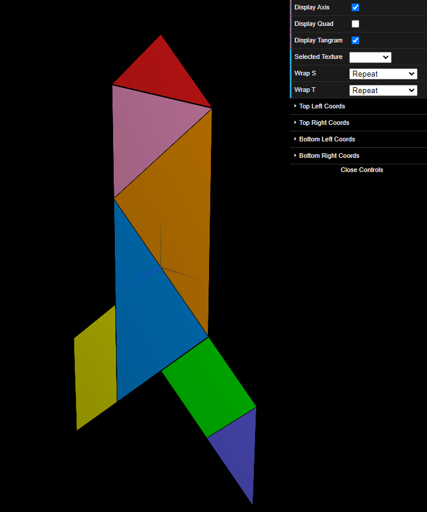
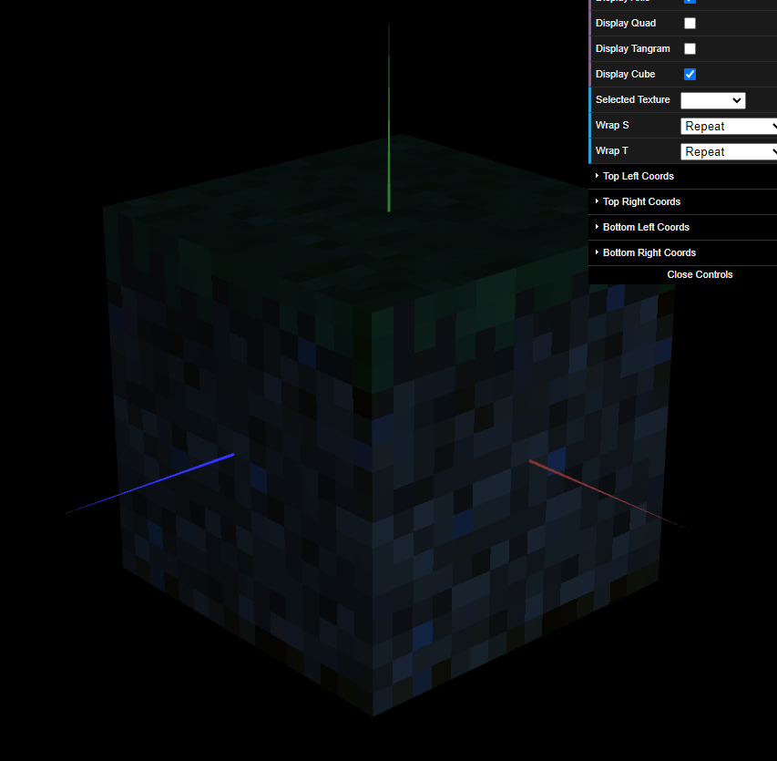

# CG 2023/2024

## Group T07G08

## TP 4 Notes

### Parte 1 - Texturas em todas as peças do Tangram

- Foi bastante simples esta parte, apenas foi necessário definir as coordenadas na textura a que cada vértice corresponde, e para isto, passamos a lista das coordenadas como argumento no construtor das peças. Tivemos também de alterar a forma de desenhar o parallelogram no `MyTangram`, porque estava desenhado inversamente.

### Parte 2 - Texturas em MyUnitCube

- Aplicar estas texturas foi diferente do exercício anterior, já que no anterior usamos a função `loadTexture` num objeto `CGFappearance`, e nesta parte usamos a função `bind` num objeto `CGFtexture` para aplicar as texturas desejadas ao cubo.

