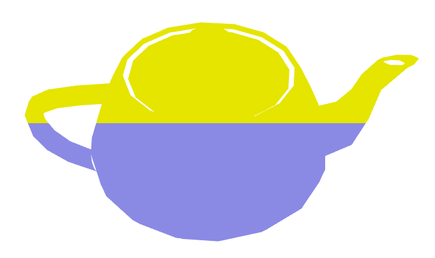
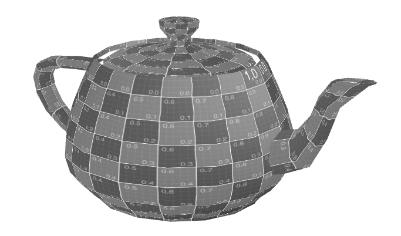
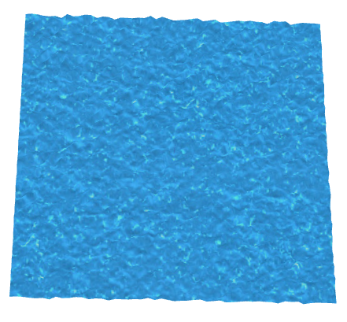

# CG 2023/2024

## Group T07G08

## TP5 Notes

### Parte 1 - Shaders no Teapot

- Na primeira parte, criamos shaders a partir do exemplo dos ficheiros `flat.vert` e `flat.frag`, criando uma variável varying para aceder às coordenadas de cada vértice, para poder usar duas cores de acordo com a coordenada no eixo y.

- A seguir, adicionamos uma animação simples, usando como exemplo o código dos ficheiros `texture3anim.vert` e `texture3anim.frag`, e mudamos as cores, convertendo todos os componentes RGB para L = 0.299R + 0.587G + 0.114B, usando como exemplo o ficheiro `sepia.frag`

### Parte 2 - Shaders no Plane: Efeito de água

- Nesta parte, usámos a textura da água com shaders no plano, fazendo com que as coordenadas de textura sejam alteradas ao longo do tempo e que os vértices sejam animados em função da cor da textura para assim criar relevo.

